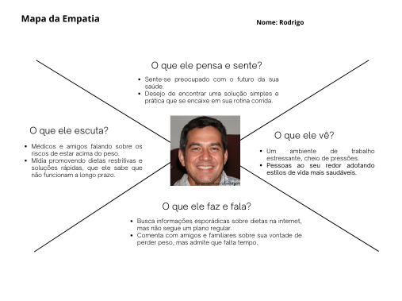
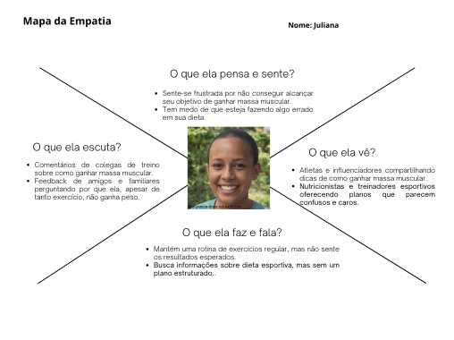
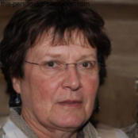
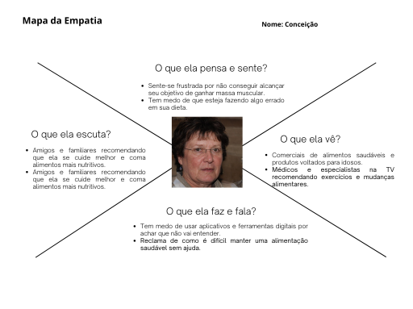
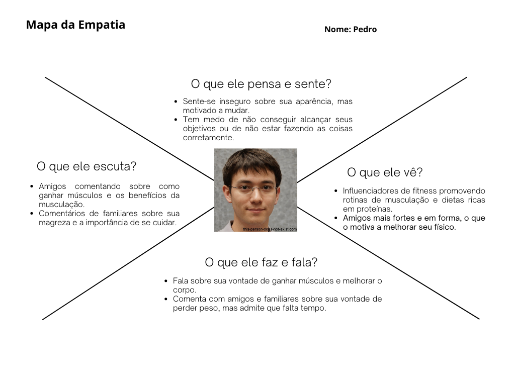

# ESPECIFICAÇÕES DO PROJETO 

## Personas

### Rodrigo, 41 anos

- **Perfil:** Rodrigo é um gerente de vendas que passa a maior parte do dia sentado em frente ao computador. Com uma rotina agitada de trabalho e pouca atividade física, ele se encontra acima do peso. Apesar de sua condição de saúde, Rodrigo não teve grandes problemas médicos até agora, mas recentemente começou a se preocupar com seu bem-estar, especialmente depois que amigos comentaram sobre os riscos da obesidade. Ele não tem conhecimento aprofundado sobre nutrição e dietas, e, por conta disso, já tentou várias vezes iniciar dietas por conta própria, mas sem sucesso. A pressão e o estresse do trabalho muitas vezes o levam a comer por impulso.

- **Objetivo:** Perder peso e adotar um estilo de vida mais saudável, equilibrando alimentação com uma rotina de exercícios físicos moderados.

- **Motivações:** Desejo de melhorar sua saúde e evitar problemas futuros, como diabetes ou doenças cardíacas. Quer se sentir mais confiante e ter mais energia para suas atividades do dia a dia.

- **Frustrações:** Falta de tempo e conhecimento para elaborar uma dieta saudável; dificuldade em manter a motivação e disciplina; medo de que as dietas restritivas o deixem sem energia no trabalho.

  
___

### Juliana,  27  anos

- **Perfil:** Juliana é uma arquiteta  ativa e apaixonada por esportes como corrida e natação. Apesar de sua intensa rotina de exercícios, ela tem dificuldades para ganhar peso e alcançar o aumento de massa  muscular  desejado.  Com  um  metabolismo  acelerado,  ela sente  que  o  que  consome  não  é  o  suficiente  para  atingir  seus objetivos de composição corporal. Juliana tem conhecimento básico sobre alimentação esportiva, mas não consegue encontrar uma solução que funcione para ela

- **Objetivo:** Ganhar peso de forma saudável e aumentar sua massa muscular, enquanto mantém o desempenho esportivo. 

- **Motivações:** Desejo de melhorar sua performance esportiva e atingir uma forma física que a faça se sentir mais forte e saudável. 

- **Frustrações:** Não entender por que, mesmo comendo bem e praticando exercícios, não consegue ganhar peso; falta de tempo para planejar refeições adequadas; medo de consumir alimentos inadequados e prejudicar seu rendimento nos esportes. s

  
___

### Conceição,  75  anos

- **Perfil:** Conceição é uma senhora aposentada que vive sozinha e cuida da casa e da sua própria alimentação. Apesar de estar no peso ideal, sua rotina é completamente sedentária e ela tem resistência  a  praticar  atividades  físicas.  Conceição  se preocupa  com  sua  saúde,  especialmente  por  sua  idade avançada e algumas recomendações médicas de melhorar a alimentação para prevenir problemas de ossos e articulações. Ela possui uma relação complicada com a tecnologia, o que a torna insegura ao usar aplicativos ou ferramentas digitais.

- **Objetivo:** Manter uma alimentação saudável que atenda suas necessidades nutricionais sem a necessidade de grandes mudanças tecnológicas ou exercícios intensos. 

- **Motivações:**  Prevenir  problemas  de  saúde  relacionados  ao  envelhecimento, como osteoporose, diabetes e doenças cardiovasculares. Deseja manter-se independente e evitar complicações médicas no futuro. 

- **Frustrações:** Dificuldade de usar tecnologia; medo de não conseguir se adaptar a uma nova dieta; não gosta de atividades físicas e tem pouca disposição para se exercitar. 
  
  
___

### Pedro, 18 anos
- **Perfil:**  Pedro  é  um  estudante  universitário  que  está começando a praticar musculação após anos de sedentarismo. Ele sempre  foi  magro  e,  recentemente,  começou  a  se preocupar com sua aparência e saúde física. Pedro tem pouco conhecimento sobre nutrição e exercícios, mas está disposto a aprender mais para ganhar massa muscular e se sentir mais confiante em seu corpo. Com a rotina de estudos e algumas atividades sociais, ele encontra dificuldade em manter uma alimentação regrada e equilibrada.

- **Objetivo:** Ganhar massa muscular de forma saudável e eficiente, combinando musculação e uma alimentação adequada. 

- **Motivações:** Melhorar sua autoestima, sentir-se mais confiante e forte fisicamente. Deseja criar uma rotina saudável que possa manter a longo prazo.

- **Frustrações:** Dificuldade de encontrar tempo para planejar as refeições corretas; falta de conhecimento sobre o que deve comer para ganhar peso; medo de não alcançar seus objetivos mesmo com esforço. 

  

## Histórias de Usuários
| **Eu Como** | **Quero/Preciso**  | **Para** |
| -------- | -------- | -------- |
| **Usuário do sistema**  | Obter o meu IMC e saber a classificação correspondente  | Saber se estou no peso ideal |
| **Usuário do sistema**  | Calcular minha Taxa Metabólica Basal (TMB) | Saber a quantidade de energia necessária para a manutenção das funções vitais do organismo    |
| **Usuário do sistema**  | Receber orientações sobre a distribuição de macronutrientes (carboidrato, proteína e lipídeo) ideal | Seguir uma dieta equilibrada sem prejuizos a saúde |
| **Usuário do sistema**  | Receber recomendações personalizadas em relação a quantidade e tipo de exercícios que devo realizar por semana  | Ter um estilo de vida balanceado e saber a recomendação mínima de atividade física de forma personalizada |
| **Usuário do sistema**  | Calcular meu Gasto Energético Total (GET)  | Saber o meu gasto calórico total diário e quanto consumir para manter o peso ideal  |
| **Usuário do sistema**  | Receber uma sugestão de déficit calórico seguro caso esteja com a classificação de IMC acima da normalidade | Atingir uma perda de peso gradual e saudável  |
| **Usuário do sistema**  | Receber recomendações sobre o tempo e intensidade de atividades físicas que devo realizar por semana | Garantir que estou praticando exercícios de forma eficaz para atingir meus objetivos de saúde    |
| **Usuário do sistema**  | Verificar a quantidade ideal de água para consumo diário com base em meu perfil  | Manter a hidratação adequada diariamente   |
| **Usuário do sistema**  | Receber orientações nutricionais gerais e fáceis de entender | Melhorar minha alimentação sem precisar aprender a usar tecnologias complicadas ou fazer mudanças drásticas na minha rotina  |

## Requisitos Funcionais
| ID  | Descrição  | Prioridade (B/M/A)* |
| -------- | -------- | -------- |
| RF01  | Cadastrar usuário na plataforma  | A  |
| RF02  | Permitir que um usuário cadastrado se autentique  | A  |
| RF03  | Exibir formulário para inserção dos dados do usuário  | A  |
| RF04  | Possibilitar a edição dos campos do formulário | A  |
| RF05  | Calcular IMC, TMB e GET a partir dos dados preenchidos  | A |
| RF06  | Orientar quantidade ideal de água que o usuário deve consumir diariamente  | M |
| RF07  | Recomendar quantidade e tipo de exercícios baseado nos dados inseridos  | M |
| RF08  | Recomendar distribuição de macronutrientes baseado nos dados inseridos | M |
| RF09  | Realizar orientações nutricionais gerais | M |
| RF10 | Exibir modais de ajuda explicando termos técnicos como FAT, IMC, TMB e GET  | B |
| RF11 | Ter persistência dos dados informados e gerados, associando ao usuário autenticado   | M |

*B=Baixa, M=Média, A=Alta.<

## Requisitos Não-Funcionais
| ID  | Descrição  | Prioridade (B/M/A)* |
| -------- | -------- | -------- |
| RNF01 | Usabilidade - A interface do usuário deve ser intuitiva, sendo fácil de operar mesmo para pessoas sem familiaridade com tecnologia  | A  |
| RNF02  | Usabilidade - O sistema deve ser responsivo, garantindo que a interface do usuário se adapte de forma fluida e sem distorções a qualquer tamanho de tela   | M |
| RNF03  | Usabilidade - O sistema deve ter um design visual atraente, utilizando uma paleta de cores harmoniosa, tipografia legível e uma interface que promova uma experiência positiva   | M |
| RNF04  | Compatibilidade - O sistema deve ser compatível com os principais navegadores (Chrome, Firefox, Safari, Edge) e suas versões mais recentes  | A |
| RNF05  | Performance - O sistema deve ser capaz de processar e responder a todas as solicitações dos usuários em até 3 segundos | M |
| RNF06  | Acessibilidade - O sistema deve prover ferramentas e/ou funcionalidades que promovam uma experiência inclusiva para usuários com deficiências audiovisuais, por exemplo, alteração de tamanho de fonte, leitura de texto em áudio, transcrição em libras, entre outras | M |

*B=Baixa, M=Média, A=Alta.

## Restrições 
| ID | Descrição |
| -------- | -------- | 
| 01 | Limitação na precisão dos dados inseridos pelo usuário, que pode impactar a confiabilidade das recomendações realizadas pelo aplicativo  | 
| 02 | Limitação de alguns cálculos e recomendações com base em localização geográfica e idioma, que podem impactar a relevância e eficácia das recomendações |
| 03 | Limitação de funcionalidades restritas às tecnologias disponíveis e permitidas à realização deste projeto  |