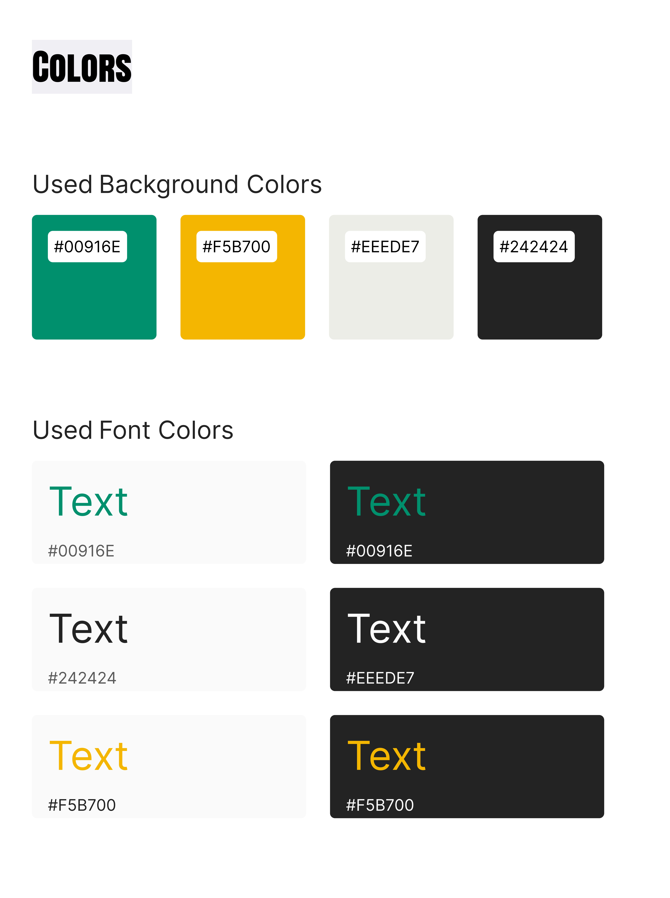
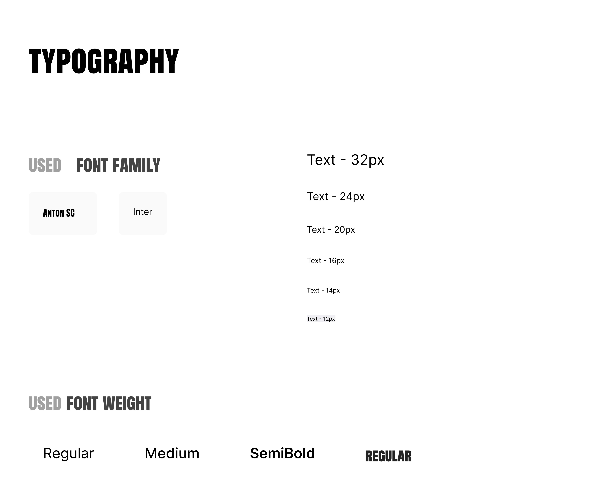
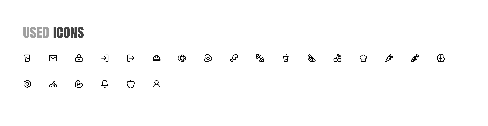
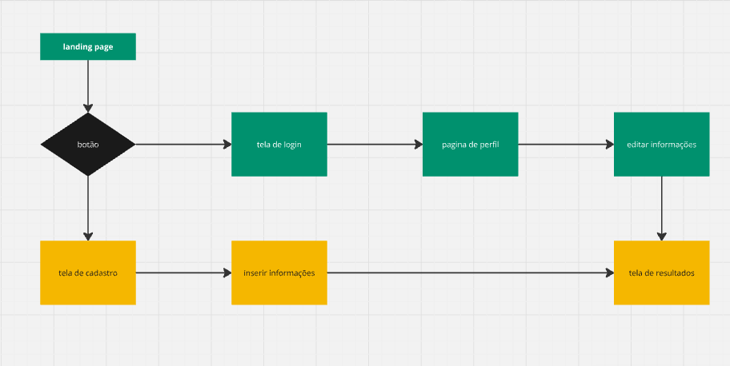
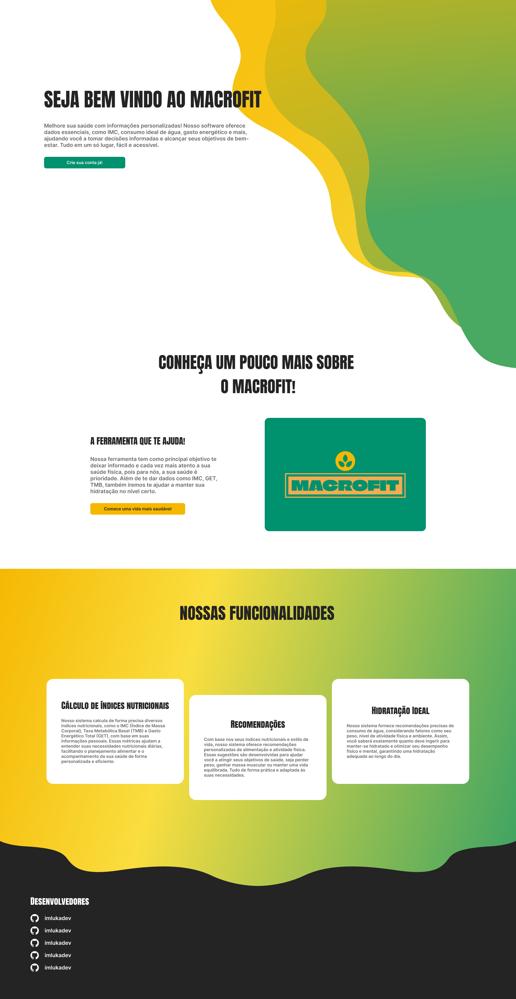
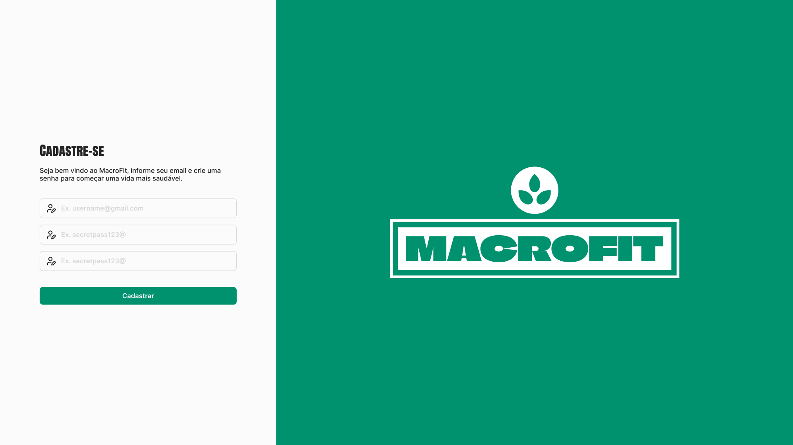
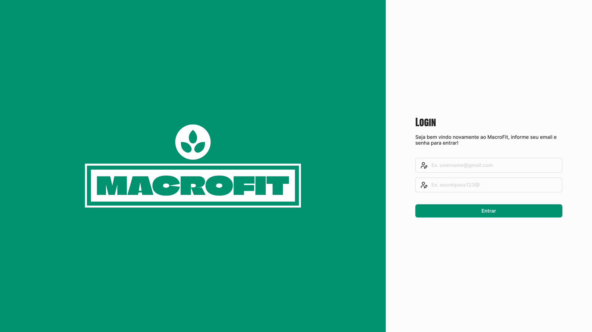
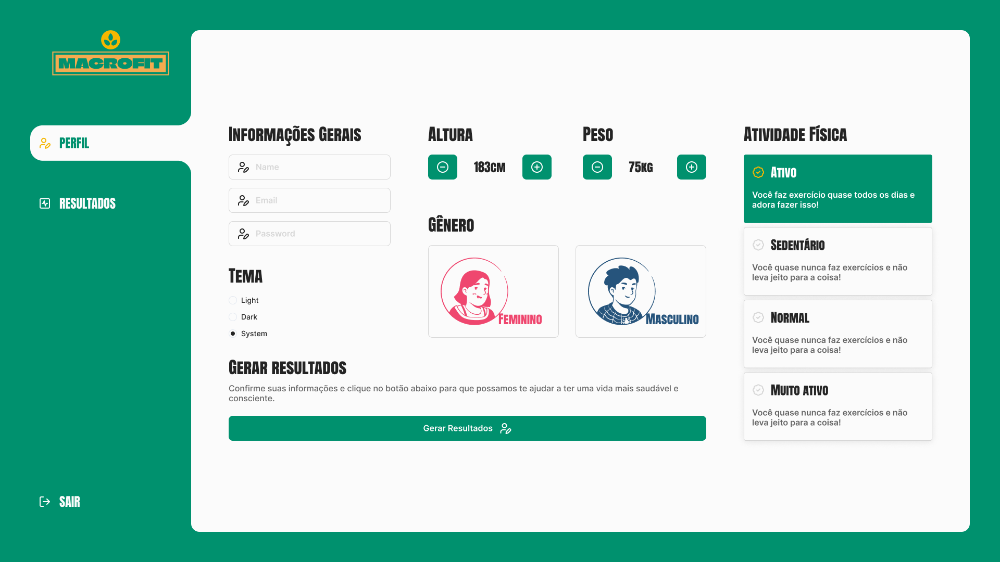
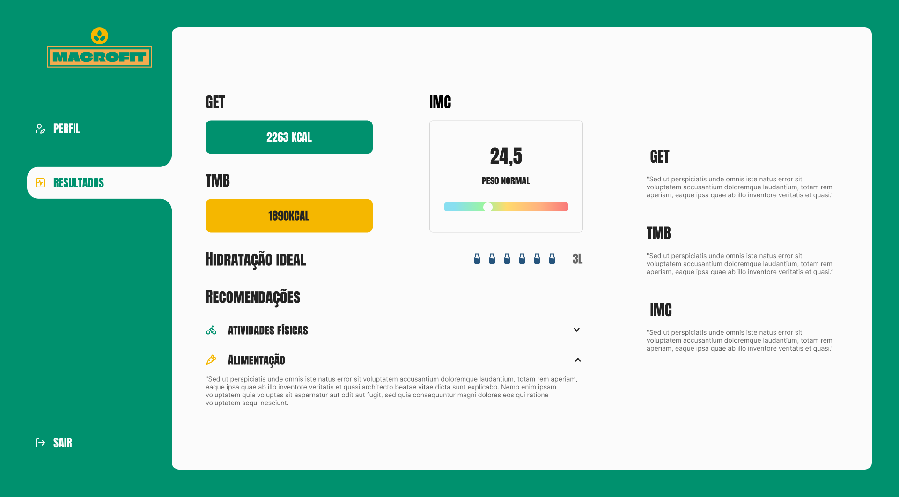

## Template padrão

O layout padrão desenvolvido para o projeto da aplicação Macrofit foi projetado com base nos princípios de funcionalidade, identidade visual coerente e responsividade. Ele será aplicado em todas as páginas, garantindo uma experiência consistente e intuitiva para os usuários. Neste projeto, buscamos criar uma interface que promova uma navegação fluida e eficaz, com foco na usabilidade e na estética, considerando aspectos como paleta de cores, tipografia, espaçamento e ícones que reforçam a temática de saúde e bem-estar.

Caso deseje visualizar nosso template, dentro deste repositório acesse a pasta `template`, onde terá o código fonte HTML.

## Design

A aplicação MacroFit foi projetada com foco na simplicidade e na facilidade de navegação, dividida em três principais layouts: a página inicial (landpage), a página de login/cadastro e a página principal do usuário. Cada uma dessas páginas segue um design coerente com a identidade visual da aplicação, garantindo uma experiência agradável e intuitiva.

- **Landpage (Página Inicial):**
A landpage tem como objetivo principal apresentar o propósito da MacroFit, que é fornecer cálculos nutricionais personalizados para os usuários. O layout é limpo e direto, com a logo da aplicação destacada no centro superior da tela, servindo como ponto de reconhecimento da marca. Abaixo da logo, há uma breve introdução sobre os benefícios da MacroFit, com seções descrevendo como o sistema funciona e os principais diferenciais.
 
- **Página de Login/Cadastro:** 
Na página de login/cadastro, a logo da aplicação ganha destaque à esquerda, criando uma identificação visual forte logo na entrada do sistema. À direita, o usuário pode optar por fazer login ou se cadastrar, com campos de entrada simples e bem espaçados, para facilitar a interação. O layout é minimalista, focando na clareza das ações que o usuário deve realizar para acessar a plataforma.

- **Página Principal:**
A página principal, acessada após o login, é onde o usuário terá acesso às funcionalidades centrais da aplicação. O layout foi dividido de forma a garantir uma navegação fácil:

- **Logo:** Fica posicionada no canto superior direito, assegurando uma presença constante da marca sem interferir nas funcionalidades.
  
 
- **Menu Lateral:** À esquerda, um menu lateral permite ao usuário navegar pelas opções de "Perfil" e "Resultados". O menu é fixo, e suas opções são claras e de fácil acesso, com ícones que reforçam a funcionalidade de cada item.
  

- **Área de Conteúdo Central:** Ao selecionar qualquer das opções no menu, as informações são exibidas na área central da tela. Na aba de "Perfil", o usuário pode inserir ou atualizar dados pessoais e de saúde. Já na aba de "Resultados", ele pode visualizar os cálculos nutricionais e estatísticas personalizadas.
  

## Cores

A paleta de cores escolhida para o MacroFit foi pensada para refletir uma sensação de saúde, energia e clareza. Cada cor desempenha um papel importante tanto no background quanto no texto, mantendo consistência e legibilidade em todas as páginas da aplicação.

**Cores Utilizadas**:

- **#00916E** (verde):
Usado tanto no background quanto no texto, este tom de verde simboliza saúde e vitalidade, criando uma conexão com o conceito de bem-estar nutricional. Ele também traz destaque para botões e ícones importantes.

- **#EEEDE7** (cinza claro):
Esta cor é utilizada principalmente como fundo em algumas seções, proporcionando um contraste sutil com as cores mais vivas. No texto, ela ajuda a suavizar o visual, mantendo a leitura agradável.

- **#F5B700** (amarelo):
Utilizado para destacar informações importantes, este tom de amarelo transmite energia e chama a atenção para áreas-chave do site, como alertas e botões de ação.

- **#242424** (preto escuro):
Usado no background padrão e também em textos, este preto escuro oferece um forte contraste com as cores mais brilhantes, proporcionando uma base sólida para o design e garantindo alta legibilidade.

**Aplicação das Cores no Texto**:

O texto varia entre **#00916E**, **#242424**, **#EEEDE7** e **#F5B700**, dependendo da seção e da importância da informação. Por exemplo, títulos podem utilizar o verde **#00916E** para destacar, enquanto o corpo do texto é apresentado em **#242424** ou **#EEEDE7**, de acordo com o contraste necessário para a legibilidade.

## Tipografia

Na MacroFit, a escolha tipográfica foi feita para garantir clareza e estilo, proporcionando uma hierarquia visual adequada para os diferentes elementos do site. As fontes selecionadas são:

### Fontes:
- **Anton SC**:
Esta fonte é utilizada para os títulos e cabeçalhos. Com seu estilo condensado e imponente, a Anton SC traz destaque e personalidade para os títulos principais, chamando a atenção para seções importantes do site. Seu tamanho varia entre 32px, dependendo do destaque necessário, mantendo o site visualmente atrativo e organizado.

- **Inter**:
A Inter foi escolhida para o corpo do texto devido à sua legibilidade e versatilidade. Ela é uma fonte moderna, sem serifa, que se adapta bem a diferentes tamanhos e resoluções de tela. O tamanho varia entre 12px e 32px, dependendo da importância do conteúdo e da hierarquia visual. A largura da fonte é ajustada conforme o contexto, alternando entre regular, medium, e semibold, para garantir uma experiência de leitura agradável e clara.

**Função no Site**:

- **Anton SC**: Utilizada para títulos, cabeçalhos de seções e áreas de destaque. Sua função é trazer visibilidade para informações-chave e guiar o usuário através das diferentes partes do site.
  

- **Inter**: Utilizada no corpo do texto, em descrições, instruções e qualquer conteúdo detalhado. Sua função é facilitar a leitura e manter a consistência em textos informativos, garantindo que o usuário tenha uma experiência fluida e sem distrações.

## Iconografia

A aplicação MacroFit utiliza a biblioteca Lucid Icons para garantir que os ícones sejam claros, modernos e intuitivos, complementando a interface com símbolos que facilitam a navegação e comunicação visual.

## Userflow

A aplicação possui um fluxo de usuário com o objetivo de ser o mais simplificado possível, para que qualquer uma de nossas personas consiga utilizar o site de maneira fluída e intuitiva.

## Apresentação do protótipo

Abaixo trazemos algumas imagens da aplicação, para ver mais da prototipação, como nosso modo escuro e a responsividade em diferentes tamanhos de tela, acesse o nosso figma no link [MacroFit - Prototipação](https://www.figma.com/design/5UiSKasSPia0N3EupCNUuS/MacroFit?node-id=0-1&t=6HxRYzrOuZfZ7ayz-1) .

